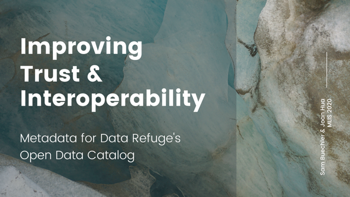

# dataRefugeCapstone
Improving Trust &amp; Interoperability: Metadata for Data Refuge's Open Data Catalog (MLIS capstone project, spring 2020)

This repository houses the project artifacts for our capstone sponsor, Margaret Janz (Penn Libraries/PPEH), who oversees the Data Refuge Data Catalog (https://www.datarefuge.org/dataset).

View project pitch on the University of Washington [Information School website](https://ischool.uw.edu/capstone/projects/2020/improving-trust-interoperability-metadata-data-refuges-open-data-catalog?fbclid=IwAR0zwh-mtn0J8ECdmbVb23Vyw5uXSPYExJQ3aA-Twzetmofn9oZFAEQNqvE).

